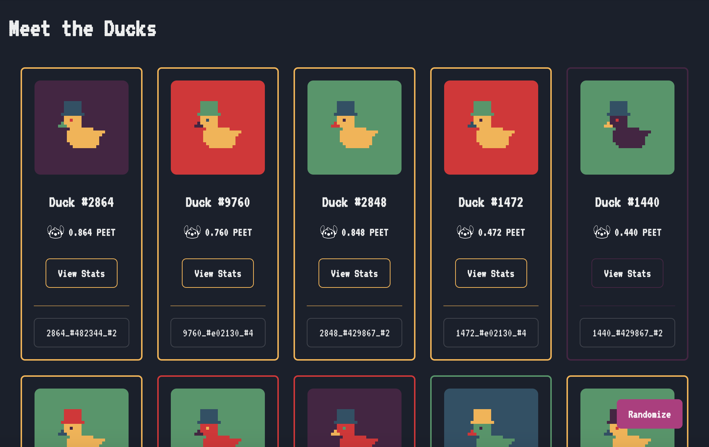

## E-Commerce Simulation Model
E-Commerce Simulation for Logistics, Marketing and Payments.
- 
- Tags: WebDev
- Badges:
  - React.js [cyan]
  - Node.js [green]
  - Chakra UI [teal]
  - Docker [blue]
- Buttons:
  - Live Site [https://construcshare.netlify.app/]
  - GitHub Repo [https://github.com/eldoraboo/construcshare]

## Music Prediction Analysis
Music Popularity Prediction Using Machine Learning Techniques.
- 
- Tags: DataSci
- Badges:
  - Python [yellow]
  - R [blue]
- Buttons:
  - Live Site [https://st4248-ay2223-b1.github.io/]
  - GitHub Repo [https://github.com/ST4248-AY2223-B1]

## ShareNStay
An online booking and rental platform, modeled after Airbnb, that incorporates SQL commands to optimize database management and user experience.
- 
- Tags: DataSci
- Badges:
  - Python [yellow]
  - SQL [gray]
- Buttons:
  - Live Site [https://sharenstay.onrender.com/]
  - GitHub Repo [https://github.com/eldoraboo/it2002-sharenstay]

## TPS Construction Website
Built a landing page for a construction firm to present them professionally. The first prototype was built in under 2 days.
- 
- Tags: WebDev
- Badges:
  - React.js [cyan]
  - Chakra UI [teal]
- Buttons:
  - Live Site [https://tpsconstruction.netlify.app/]
  - GitHub Repo [https://github.com/eldoraboo/tps-construction]

## Scales.io
Developed a custom piano key visualizer for music scales, providing a user-friendly tool for musicians to practice and improve their skills. Utilized React.js and Chakra UI to create an interactive and visually appealing interface. The tool received positive feedback from users.
- 
- Tags: WebDev
- Badges:
  - React.js [cyan]
  - Chakra UI [teal]
- Buttons:
  - Live Site [https://scales-io.netlify.app/]
  - GitHub Repo [https://github.com/eldoraboo/scales-io]

## Auto-Labeling Pipeline
Built a highly efficient auto-labeling pipeline for text classification, utilizing cutting-edge technologies such as spaCy, Hugging Face, and Docker. The pipeline significantly reduced manual labeling efforts and improved the accuracy of text classification tasks. Demonstrated expertise in NLP and data engineering by seamlessly integrating various tools and technologies to create a cohesive solution.
- 
- Tags: Python, DevOps
- Badges:
  - Python [yellow]
  - Docker [blue]
  - spaCy [green]
- Buttons:
  - GitHub Repo [https://github.com/eldoraboo/auto-labeling]

## Pixel Duck
Designed and programmed a web app that generates unique pixel ducks based on user-specified or randomized color inputs. Allows users to copy the generated duck in SVG format. Technologies used include HTML, CSS, React.js, and Chakra UI.
- 
- Tags: WebDev
- Badges:
  - React.js [cyan]
  - Chakra UI [teal]
- Buttons:
  - Live Site [https://pixel-duck.netlify.app/]
  - GitHub Repo [https://github.com/eldoraboo/pixel-duck]